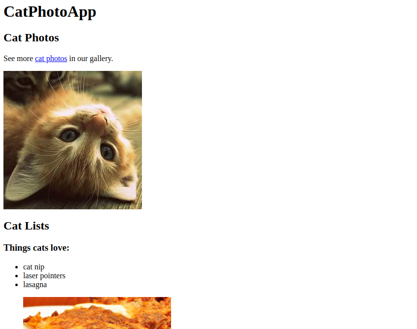
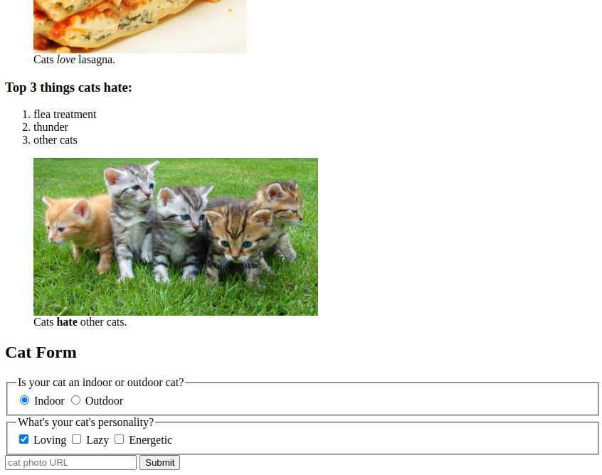

# Cat Photo App

HTML tags give a webpage its structure. You can use HTML tags to add photos, buttons, and other elements to your webpage.
<br>
In this project, I learned the most common HTML tags by building your own cat photo app.
<br>

## Here is the preview of What i am going to Build.



## Tags
- Headings
    ```html
    <h1>CatPhotoApp</h1>
    <h2>Cat Photos</h2>
    ```
- Paragraph
    ```html
        <p>See more cat photos in our gallery.</p>
    ```
- Comments
    ```html
        <!-- TODO: Add Link to Cat Photos  -->
    ```

### Main element
- HTML5 has some elements that identify different content areas. These elements make your HTML easier to read and help with Search Engine Optimization (SEO) and accessibility.
- The `main` element is used to represent the main content of the body of an HTML document.
- Content inside the main element should be unique to the document and should not be repeated in other parts of the document.
```html
<main>
  <h1>Most important content of the document</h1>
  <p>Some more important content...</p>
</main>
```

##### Nesting & Indentation
- In the previous step, you put the `h1`, `h2`, comment, and `p` elements inside the main element. This is called `nesting`.
- Nested elements should be placed two spaces further to the right of the element they are nested in.

### Image Tag
- You can add images to your website by using the img element. img elements have an opening tag **without a closing tag**.
- An element without a closing tag is known as a `void element`.

```html

```

### Anchor Tag
```html
<a href="https://www.freecodecamp.org">click here to go to freeCodeCamp.org</a>
```
- You can turn any text into a link, such as the text inside of a p element.
```
<p>See more <a href="https://freecatphotoapp.com">cat photos</a> in our gallery.</p>
```
- To open links in a new tab, you can use the `target` attribute on the anchor (a) element.
- The `target` attribute specifies where to open the linked document. `target="_blank"` opens the linked document in a new tab or window.
```
<p>See more <a href="https://freecatphotoapp.com" target="_blank">cat photos</a> in our gallery.</p>
```
- Other types of content (e.g. images) can also be turned into a link by wrapping it in anchor tags.

### Section Tag
- The `section` element is used to define sections in a document, such as chapters, headers, footers, or any other sections of the document. It is a semantic element that helps with SEO and accessibility.
```
<section>
  <h2>Section Title</h2>
  <p>Section content...</p>
</section>
```

### Unorder List (ul)
```html
<ul>
  <li>milk</li>
  <li>cheese</li>
</ul>
```

### Figure Element
The `figure` element represents self-contained content and will allow you to associate an image with a caption.

#### figcaption
A figure caption (figcaption) element is used to add a caption to describe the image contained within the figure element.
**Example Code**
```
<figure>
  
  <figcaption>A cute cat</figcaption>
</figure>
```

#### `figure` vs `img`

### *em* Tag
To place emphasis on a specific word or phrase, you can use the `em` element.
- Basically it makes an text *Italic*

### **strong** Tag
The `strong` element is used to indicate that some text is of strong importance or urgent.
- Basically **Bold**


### ordered list (ol)
The code for an ordered list (ol) is similar to an unordered list, but list items in an ordered list are numbered when displayed.
```
<ol>
    <li>flea treatment</li>
    <li>thunder</li>
    <li>other cats</li>
</ol>
```

### Form 
The `form` element is used to get information from a user like their name, email, and other details.

#### Action attribute
The action attribute indicates where form data should be sent.

Here is an example of a form element with an action attribute:

**Example Code**
```
<form action="/submit-url"></form>
```
In the example, action="/submit-url" tells the browser that the form data should be sent to the path /submit-url.

#### Input
The input element allows you several ways to collect data from a web form. 
- Like img elements, input elements are a void element and do not need closing tags.

#### Input Type
There are many kinds of inputs you can create using the `type` attribute. You can easily create a password field, reset button, or a control to let users select a file from their computer.

Create a text field to get text input from a user by adding the `type` attribute with the value `text` to the `input` element.

#### Name Attribute
In order for a form's data to be accessed by the location specified in the `action` attribute, you must give the text field a `name` attribute and assign it a value to represent the data being submitted.

Here is an example of an `input` element with a `name` attribute:

Example Code:
```
<input type="text" name="name">
```

#### Placeholder Attribute
Placeholder text is used to give people a hint about what kind of information to enter into an input.

Here is an example of an input element with a `placeholder` set to Ex. Jane Doe:

Example Code:
```
<input type="text" placeholder="Ex. Jane Doe">
```

#### Required Attribute
To prevent a user from submitting your form when required information is missing, you need to add the required attribute to an input element. 
- There's no need to set a value to the required attribute. 
- Instead, just add the word required to the input element, making sure there is space between it and other attributes.

#### Submit Button
The `button` element is used to create a clickable button.

Add a button element with the text Submit below the input element. The default behavior of clicking a form button without any attributes submits the form to the location specified in the form's action attribute.

#### Submit Type
Even though you added your button below the text input, they appear next to each other on the page. That's because both input and button elements are inline elements, which don't appear on new lines.

The button you added will submit the form by default. However, relying on default behavior may cause confusion. Add the type attribute with the value submit to the button to make it clear that it is a submit button.

#### Radio Type Input
You can use radio buttons for questions where you want only one answer out of multiple options.

Here is an example of a radio button with the text set as cat:

Example Code:
```
<input type="radio"> cat
```
- Remember that an input element is a void element.

#### Label Element
`label` elements are used to help associate the text for an `input` element with the input element itself (especially for assistive technologies like screen readers).

Here is an example of a label element with a radio button:

Example Code:
```
<label><input type="radio"> cat</label>
```
In the example, clicking on the word "cat" will also select the radio button.

#### Id Attribute
The `id` attribute is used to identify specific HTML elements. 
- Each id attribute's value must be unique from all other id values for the entire page.

Here is an example of an input element with an id attribute:

Example Code:
```
<input id="email">
```

#### Importance of `name` attribute in `radio`
Notice that both radio buttons can be selected at the same time. To make it so selecting one radio button automatically deselects the other, both buttons must have a name attribute with the same value.

Here is an example of two radio buttons with the same name attribute:

Example Code:
```
<input type="radio" name="meal"> Breakfast
<input type="radio" name="meal"> Lunch
```

#### `Value` Attribute for radio
If you select the Indoor radio button and submit the form, the form data for the button is based on its name and value attributes. Since your radio buttons do not have a value attribute, the form data will include indoor-outdoor=on, which is not useful when you have multiple buttons.

Add a value attribute to both radio buttons. For convenience, set the button's value attribute to the same value as its id attribute.

#### Fieldset Element
The fieldset element is used to group related inputs and labels together in a web form. fieldset elements are block-level elements, meaning that they appear on a new line.

#### Legend Element
The legend element acts as a caption for the content in the fieldset element. It gives users context about what they should enter into that part of the form.

#### Associate Label with Input
